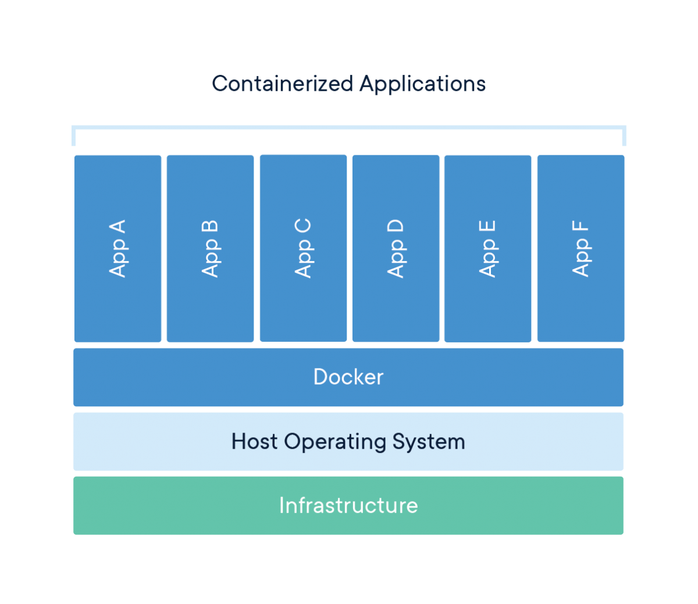

# Inception-42
This project uses Docker containers to create an infrastructure for WordPress. The infrastructure consists of Nginx, WordPress and PHP-FPM, and MariaDB. It also includes Redis, FTP, Adminer, cAdvisor, each service in their own container. The containers are built using Dockerfiles based on Debian, and Docker-Compose is used to manage the containers.

## Containers Technology
Containers technology allows you to run applications in a lightweight and isolated environment. Each container shares the same kernel as the host system, but has its own isolated filesystem, network stack, and process space. This is achieved through the use of several underlying technologies, including namespaces, cgroups.

## Namespaces
Namespaces provide a way to isolate resources within a container. Docker uses several different namespaces to achieve this isolation, including:

pid: This isolates the process ID number space. Each container has its own process ID space.
net: This isolates the network stack. Each container has its own network stack, including its own IP address.
ipc: This isolates inter-process communication resources. Each container has its own IPC namespace.
mnt: This isolates the filesystem mount points. Each container has its own filesystem namespace.
uts: This isolates the hostname and domain name.

## Cgroups
Cgroups provide a way to limit the resources that containers can consume. Docker uses cgroups to control the amount of CPU, memory, and block device I/O that each container can use.

## Docker's Filesystem
Docker's filesystem provides a layered approach to building containers. Each layer represents a change to the filesystem, and each layer is stored as a separate entity. This allows Docker to optimize the build process by only rebuilding layers that have changed, rather than rebuilding the entire filesystem for each build.

## Read-Only Layers
Read-only layers in Docker's filesystem are layers that cannot be modified. They are used to store the base image, which provides the foundation for the container's filesystem. Each layer in a Docker image is immutable, meaning that it cannot be modified once it has been created.

The read-only layers are created by taking the differences between the current layer and the previous layer, and then compressing and storing those differences as a new layer. This approach allows Docker to optimize storage by reusing layers that have not changed between images.

## Copy-On-Write mechanism
If the container needs to modify a file or directory that is stored in a read-only layer, Docker creates a new copy-on-write layer on top of the it. This new layer is initially empty, and contains no files or directories. Any changes made to the filesystem by the container are written to this new layer.

This approach allows multiple containers to share the same read-only layer, while each container can have its own copy-on-write layer for any changes it makes to the filesystem. This reduces the storage requirements for containers, as only the changes made by each container need to be stored in the copy-on-write layers.

## Docker
Docker is an open-source software for building, shipping, and running containers. Docker provides a set of tools and services for managing containers, including the Docker Engine, which is the core component of Docker, and the Docker CLI, which provides a command-line interface for managing containers.

Docker's main role is to manage containers and provide a consistent environment for running applications. Docker provides a simple and efficient way to package and distribute applications, while ensuring that they run consistently across different environments.

## Docker Compose
Docker Compose is a tool for defining and running multi-container Docker applications. It allows you to define all of your application's services, networks, volumes in a single file, and then start and stop your entire application with a single command. Docker Compose provides a way to orchestrate the containers in your application, ensuring that they start and stop in the correct order and that they are properly connected to each other.

## Services
this is short introduction to the services I used in my infrastructure :

### Nginx: 
Nginx is a web server that can also be used as a reverse proxy, load balancer, and HTTP cache. In my project, Nginx is used to proxy requests to the WordPress and PHP-FPM container.

### WordPress:
WordPress is a popular content management system that is used to create websites and blogs. In my project, WordPress is used to serve dynamic content, such as blog posts and pages.

### PHP-FPM:
PHP-FPM is a FastCGI implementation for PHP that is used to process PHP code. In my project, PHP-FPM is used to serve the dynamic content generated by WordPress.

### MariaDB:
MariaDB is a community-developed fork of the MySQL relational database management system. In my project, MariaDB is used to store the data used by WordPress.

### Redis:
Redis is an in-memory data store that can be used as a cache or a message broker. In my project, Redis is used as a cache for WordPress.

### FTP:
FTP is a protocol used for transferring files over the internet. In my project, an FTP server is used to allow the user to upload and retrieve files to the volume containing wordpress files.

### Adminer:
Adminer is a web-based database management tool that can be used to manage MySQL, MariaDB, and PostgreSQL databases. In my project, Adminer is used to manage the MariaDB database.

### CAdvisor:
CAdvisor is a tool that is used to monitor Docker containers. In my project, CAdvisor is used to monitor the resource usage of the containers.

-----------------------------------------------------------------------------------------------------------------------------------------------------------------

This was just an overview of the project and containers technology, if you want to make a deep dive into it this is a list of resources that would help you to get started:
- https://www.freecodecamp.org/news/the-docker-handbook/#introduction-to-containerization-and-docker
- https://cloud.google.com/architecture/best-practices-for-building-containers#signal-handling
- https://martinheinz.dev/blog/44
- https://www.youtube.com/watch?v=sK5i-N34im8&ab_channel=Docker
- https://www.youtube.com/watch?v=el7768BNUPw&ab_channel=SeanWingert
- https://daveiscoding.com/why-do-you-need-an-init-process-inside-your-docker-container-pid-1
- https://medium.com/@saschagrunert/demystifying-containers-part-i-kernel-space-2c53d6979504
- http://docker-saigon.github.io/post/Docker-Internals/